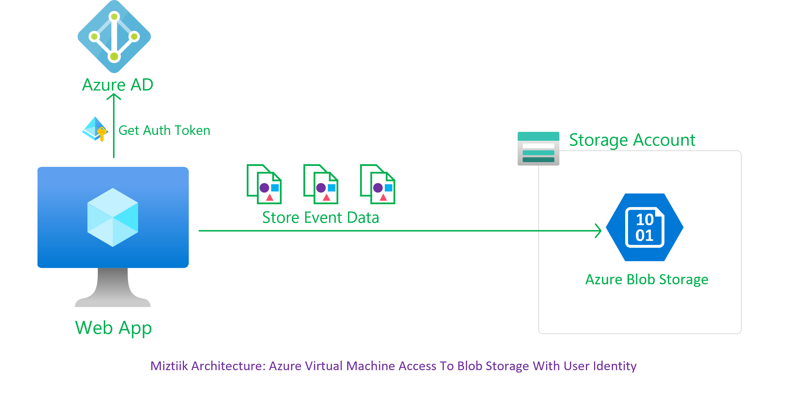
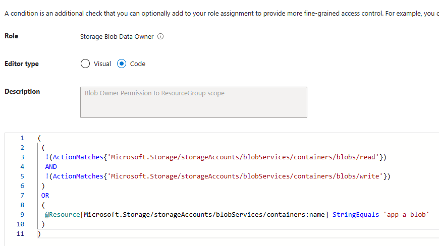

# User Identity with narrow scopes


It is commong for Azure Storage accounts to host multiple blob containers. In that case it becomes necessary to scope the access to individual blobs as narrowly as possible. For ex, `Application-A` should only have access to `Blob-A` and nothing else. This can be achieved by using Azure RBAC<sup>[1]</sup>. Attribute based access control(ABAC) is getting really common now-a-days, scope the access even narrower, _i,e The identity will have access to only certain files with certain attributes - for example tagged `owner:Application-A`_.

In this blog, we will have a look at RBAC - Create a user managed identity role scoped with conditional access specific to a container. This is stratight-forward with portal/ARM, But with bicep the publicly available documentation is unclear. So lets try to build in bicep

## 🎯 Solutions

To store all the order events, we will create a blob container. To write the events to the container, lets use a user managed identity with it permission scoped narrowly to a specific blob conainer using Azure RBAC.<sup>[1], [2], [3]</sup>.




Lets create a storage account and a blob container,

```bicep
@description('Azure region of the deployment')
param location string = 'westeurope'

@description('Name of the storage account')
param storageAccountPrefix string = 'enterpriseA'

@description('Name of the Blob Container')
param blobContainerName string = 'app-A-Blob'

@description('Name of the User Managed Identity')
param userManagedIdentityName string = 'app-A-Owner'

var saName = '${storageAccountPrefix}${substring(uniqueString(resourceGroup().id), 0, 6)}'

resource r_sa 'Microsoft.Storage/storageAccounts@2022-05-01' = {
  name: saName
  location: location
  sku: {
    name: 'Standard_LRS'
  }
  kind: 'StorageV2'
  properties: {
    minimumTlsVersion: 'TLS1_2'
    allowBlobPublicAccess: false
    supportsHttpsTrafficOnly: true
    networkAcls: {
      bypass: 'AzureServices'
      defaultAction: 'Allow'
    }
  }
}

// Create a blob storage container in the storage account
resource r_blobSvc 'Microsoft.Storage/storageAccounts/blobServices@2021-06-01' = {
  parent: r_sa
  name: 'default'
}

resource r_blobContainer 'Microsoft.Storage/storageAccounts/blobServices/containers@2021-04-01' = {
  parent: r_blobSvc
  name: blobContainerName
  properties: {
    publicAccess: 'None'
  }
}
```

Lets create the user managed identity,

```bicep
// Create User-Assigned Identity
resource r_userManagedIdentity 'Microsoft.ManagedIdentity/userAssignedIdentities@2023-01-31' = {
  name: '${userManagedIdentityName}_Identity'
  location: location
}
```

So far, nothing out of the ordinary. When it comes to scoping this identity's permission to the specific storage account, we need to `condition`s to our role assignment resource. The official docs<sup>4</sup> gives this recommendations,

```bicep
resource symbolicname 'Microsoft.Authorization/roleAssignments@2022-04-01' = {
  name: 'string'
  scope: resourceSymbolicName or tenant()
  properties: {
    condition: 'string'
    conditionVersion: 'string'
    delegatedManagedIdentityResourceId: 'string'
    description: 'string'
    principalId: 'string'
    principalType: 'string'
    roleDefinitionId: 'string'
  }
}
```

1. **Issue** - The guidance for the `condition` property is expected to be a `string` and gives this example value `@Resource[Microsoft.Storage/storageAccounts/blobServices/containers:ContainerName] StringEqualsIgnoreCase 'foo_storage_container'`

    If you try to set this in your bicep, you will get an "**Condition Invalid**" error & If you have tried setting up conditions in the portal, you will realize this string is missing the `Action` permitted on the resource. If we take a look at the ARM Documentation<sup>[5]</sup>, the condition will look like this (_formatted for readability_),

    ```
    (
      (
        !(ActionMatches{'Microsoft.Storage/storageAccounts/blobServices/containers/blobs/read'})
      )
      OR 
      (
        @Resource[Microsoft.Storage/storageAccounts/blobServices/containers:name] StringEquals 'blobs-example-container'
      )
    )
    ```

1. **Issue** - The doc doesn't clearly say if `conditionVersion` is a required field. But missing that out will result in an error. Currently the value is hard bound to `2.0`.

    With this knowledge we can create our bicep with a Blob owner Role with `read` and `write` privileges like this. To build the string properly and to improve readability of the code, I have put the condition in another string.


    ```bicep
    // Azure Built-In Roles Ref: https://learn.microsoft.com/en-us/azure/role-based-access-control/built-in-roles
    param blobOwnerRoleId string = 'b7e6dc6d-f1e8-4753-8033-0f276bb0955b'
    param blobContributorRoleId string = 'ba92f5b4-2d11-453d-a403-e96b0029c9fe'

    var conditionStr= '((!(ActionMatches{\'Microsoft.Storage/storageAccounts/blobServices/containers/blobs/read\'}) AND !(ActionMatches{\'Microsoft.Storage/storageAccounts/blobServices/containers/blobs/write\'}) ) OR (@Resource[Microsoft.Storage/storageAccounts/blobServices/containers:name] StringEquals \'${blobContainerName}\'))'


    // Refined Scope with conditions
    resource r_attachBlobOwnerPermsToRole 'Microsoft.Authorization/roleAssignments@2022-04-01' = {
      name: guid('r_attachBlobOwnerPermsToRole', r_userManagedIdentity.id, blobOwnerRoleId)
      scope: r_blobContainer
      properties: {
        description: 'Blob Owner Permission to ResourceGroup scope'
        roleDefinitionId: resourceId('Microsoft.Authorization/roleDefinitions', blobOwnerRoleId)
        principalId: r_userManagedIdentity.properties.principalId
        conditionVersion: '2.0'
        condition: conditionStr
        principalType: 'ServicePrincipal'
      }
    }
    ```

Putting it all toegether, the `main.bicep` in this blog has all the code. Let us deploy this bicep,(_update the RG Name_)

```bash
MAIN_BICEP_TEMPL_NAME="main.bicep"
SUB_DEPLOYMENT_PREFIX="userManagedIdentityDemo"
LOCATION="westeurope"

RG_NAME=""


az deployment group create \
    --name ${SUB_DEPLOYMENT_PREFIX}"-Deployment" \
    --resource-group ${RG_NAME} \
    --location ${LOCATION} \
    --template-file ${MAIN_BICEP_TEMPL_NAME}

```

Upon successful deployment you can check the Role Assignment conditions from the storage account portal.




### 💡 Help/Suggestions or 🐛 Bugs

Thank you for your interest in contributing to our project. Whether it is a bug report, new feature, correction, or additional documentation or solutions, we greatly value feedback and contributions from our community. [Start here](/issues)

### 👋 Buy me a coffee

[](https://ko-fi.com/Q5Q41QDGK) Buy me a [coffee ☕][900].

### 📚 References


1. [Azure Docs: Azure RBAC][1]
1. [Azure Docs: Azure ABAC][2]
1. [Azure Docs: Azure RBAC Example Conditions][3]
1. [Azure Docs: Bicep Role Assignments][4]
1. [Azure Docs: ARM Role assignment conditions][5]


### 🏷️ Metadata


**Level**: 100

[1]: https://learn.microsoft.com/en-us/azure/role-based-access-control/conditions-role-assignments-portal
[2]: https://learn.microsoft.com/en-us/azure/role-based-access-control/conditions-overview
[3]: https://learn.microsoft.com/en-us/azure/storage/blobs/storage-auth-abac-examples?toc=%2Fazure%2Frole-based-access-control%2Ftoc.json
[4]: https://learn.microsoft.com/en-us/azure/templates/microsoft.authorization/roleassignments?pivots=deployment-language-bicep
[5]: https://learn.microsoft.com/en-us/azure/role-based-access-control/conditions-role-assignments-template


[100]: https://www.udemy.com/course/aws-cloud-security/?referralCode=B7F1B6C78B45ADAF77A9
[101]: https://www.udemy.com/course/aws-cloud-security-proactive-way/?referralCode=71DC542AD4481309A441
[102]: https://www.udemy.com/course/aws-cloud-development-kit-from-beginner-to-professional/?referralCode=E15D7FB64E417C547579
[103]: https://www.udemy.com/course/aws-cloudformation-basics?referralCode=93AD3B1530BC871093D6
[899]: https://www.udemy.com/user/n-kumar/
[900]: https://ko-fi.com/miztiik
[901]: https://ko-fi.com/Q5Q41QDGK